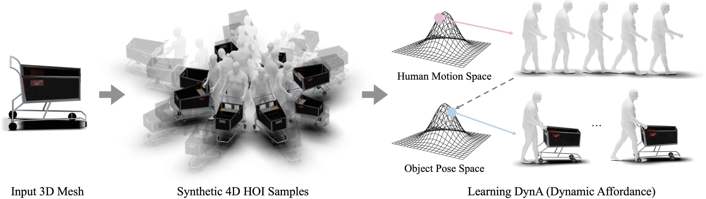

# <p align="center"> DAViD: Modeling Dynamic Affordance of 3D Objects using Pre-trained Video Diffusion Models </p>

## [Project Page](https://snuvclab.github.io/david/) &nbsp;|&nbsp; [Paper](https://arxiv.org/pdf/2501.08333) 



This is the official code for the paper "DAViD: Modeling Dynamic Affordance of 3D Objects using Pre-trained Video Diffusion Models".


## Regarding Code Release
- The code will be updated and available soon.
<!-- ## News -->


<!-- ## Citation
```bibtex
``` -->

<!-- ## License
This work is licensed under a <a href="https://creativecommons.org/licenses/by-nc-sa/4.0/">Creative Commons Attribution-NonCommercial-ShareAlike 4.0 International License</a>. -->